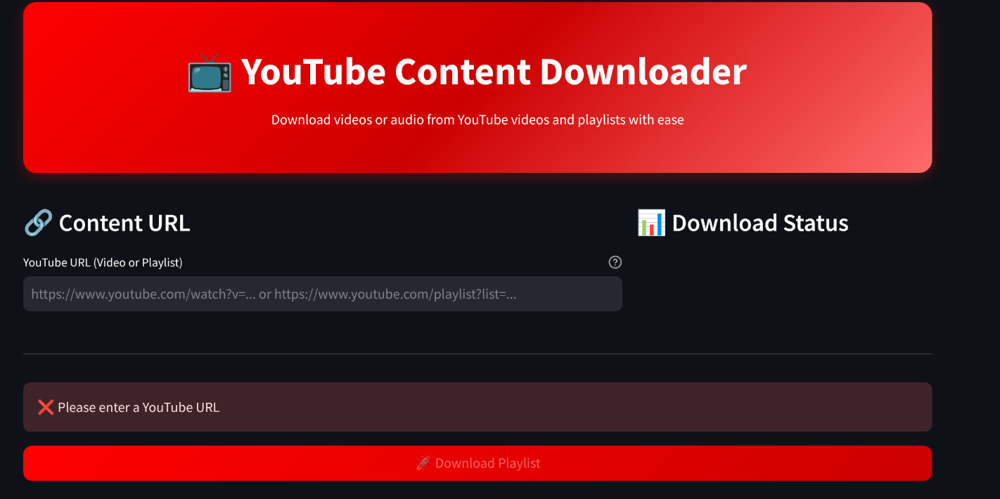

# 📺 YouTube Content Downloader

A modern, feature-rich YouTube downloader built with Python and Streamlit. Download individual videos or entire playlists with ease, supporting multiple formats and quality options.


*Main interface of the YouTube Content Downloader*

## ✨ Features

### 🎯 **Dual Content Support**
- **Single Videos**: Download any YouTube video with a simple URL
- **Playlists**: Download entire playlists or select specific video ranges
- **Smart Detection**: Automatically detects whether the URL is a video or playlist

### 🎨 **Modern User Interface**
- **Beautiful Design**: Clean, modern interface with gradient styling
- **Real-time Validation**: Instant URL validation with helpful feedback
- **Progress Tracking**: Live download progress with speed and ETA information
- **Responsive Layout**: Works seamlessly on desktop and mobile devices


*Video preview with metadata and thumbnail*

### 📊 **Rich Content Previews**
- **Video Thumbnails**: Visual previews for single videos
- **Metadata Display**: Shows title, channel, duration, views, and likes
- **Playlist Information**: Complete playlist details with video count
- **Tag Display**: Shows relevant video tags for better context

### 🎵 **Multiple Format Options**
- **Video (MP4)**: Full video downloads with multiple quality settings
- **Audio (MP3)**: High-quality audio extraction (128kbps - 320kbps)
- **Audio (M4A)**: Native audio format preservation
- **Quality Control**: Best, medium, and low quality options


*Real-time download progress tracking*

### ⚡ **Performance & Reliability**
- **Smart Caching**: Prevents redundant API calls for better performance
- **Error Handling**: Comprehensive error messages with troubleshooting tips
- **Progress Tracking**: Real-time download speed, ETA, and file progress
- **Retry Logic**: Automatic retry for failed downloads

### 🔧 **Advanced Features**
- **Subtitle Support**: Download subtitles in multiple languages
- **Custom Output Directory**: Choose where to save your files
- **Quick Actions**: One-click download presets for common use cases
- **Batch Downloads**: Download multiple videos from playlists efficiently

## 🚀 Quick Start

### Prerequisites

- Python 3.7 or higher
- pip (Python package installer)

### Installation

1. **Clone the repository**
   ```bash
   git clone https://github.com/dhecaptain/youtube-downloader-app.git
   cd youtube-downloader-app
   ```

2. **Create a virtual environment**
   ```bash
   python -m venv env
   source env/bin/activate  # On Windows: env\Scripts\activate
   ```

3. **Install dependencies**
   ```bash
   pip install -r requirements.txt
   ```

4. **Run the application**
   ```bash
   streamlit run app.py
   ```

The app will open in your default browser at `http://localhost:8501`


*Installation process demonstration*

## 📖 Usage Guide

### For Single Videos

1. **Paste the URL**: Copy any YouTube video URL into the input field
2. **Choose Format**: Select Video (MP4) or Audio (MP3/M4A)
3. **Select Quality**: Choose between best, medium, or low quality
4. **Download**: Click the download button and wait for completion

### For Playlists

1. **Paste Playlist URL**: Use any YouTube playlist URL
2. **Set Range**: Choose which videos to download (optional)
3. **Configure Settings**: Select format, quality, and output directory
4. **Start Download**: Begin the batch download process


*Different usage scenarios*

### Supported URL Formats

- `https://www.youtube.com/watch?v=VIDEO_ID` (Single video)
- `https://youtu.be/VIDEO_ID` (Short video URL)
- `https://www.youtube.com/playlist?list=PLAYLIST_ID` (Playlist)
- `https://www.youtube.com/watch?v=VIDEO_ID&list=PLAYLIST_ID` (Video in playlist)

## ⚙️ Configuration Options

### Download Formats
- **Video (MP4)**: Best quality up to 1080p, with audio
- **Audio (MP3)**: Extracted audio in MP3 format
- **Audio (M4A)**: Native audio format

### Quality Settings
- **Best**: Highest available quality (up to 1080p for video, 320kbps for audio)
- **Medium**: Balanced quality (720p for video, 192kbps for audio)
- **Low**: Lower quality for faster downloads (480p for video, 128kbps for audio)

### Advanced Options
- **Subtitles**: Download subtitle files when available
- **Custom Output**: Specify custom download directory
- **Retry Logic**: Configure retry attempts for failed downloads


*Advanced settings configuration*

## 🛠️ Technical Details

### Built With
- **[Streamlit](https://streamlit.io/)**: Web application framework
- **[yt-dlp](https://github.com/yt-dlp/yt-dlp)**: YouTube download engine
- **[Python](https://python.org/)**: Core programming language

### Architecture
```
app.py                 # Main application file
├── validate_url()     # URL validation and type detection
├── get_content_info() # Fetch video/playlist metadata
├── download_content() # Handle downloads with progress tracking
└── main()            # Streamlit UI and application logic
```

### Key Dependencies
```
streamlit>=1.28.0
yt-dlp>=2023.7.6
Pillow>=9.0.0
```

## 🔒 Privacy & Legal

This tool is designed to respect YouTube's terms of service and should be used responsibly:

- ✅ Download content you have permission to download
- ✅ Respect copyright and intellectual property rights
- ✅ Use for personal, educational, or fair use purposes
- ❌ Do not redistribute copyrighted content
- ❌ Do not use for commercial purposes without permission

## 🐛 Troubleshooting

### Common Issues

**"Video unavailable" error**
- Check if the video is public and not restricted in your region
- Try a different video URL to test the application

**"Permission denied" error**
- Ensure you have write permissions to the output directory
- Try using a different output folder (e.g., Desktop)

**Download fails repeatedly**
- Check your internet connection
- Try downloading a single video first
- Some videos may be geo-blocked or age-restricted

**Application won't start**
- Ensure all dependencies are installed: `pip install -r requirements.txt`
- Check Python version: `python --version` (3.7+ required)
- Try running in a fresh virtual environment


*Common error messages and solutions*

## 🤝 Contributing

Contributions are welcome! Here's how you can help:

1. **Fork the repository**
2. **Create a feature branch**: `git checkout -b feature/amazing-feature`
3. **Make your changes**: Implement your feature or bug fix
4. **Test thoroughly**: Ensure your changes work as expected
5. **Commit your changes**: `git commit -m 'Add amazing feature'`
6. **Push to the branch**: `git push origin feature/amazing-feature`
7. **Open a Pull Request**: Describe your changes and submit for review

### Development Setup

```bash
# Clone your fork
git clone https://github.com/YOUR_USERNAME/youtube-downloader-app.git
cd youtube-downloader-app

# Create development environment
python -m venv dev-env
source dev-env/bin/activate

# Install development dependencies
pip install -r requirements.txt
pip install -r requirements-dev.txt  # If available

# Run tests
python test_app.py

# Start development server
streamlit run app.py
```

## 📝 Changelog

### Version 2.0.0 (Latest)
- ✨ Added single video download support
- 🎨 Modern UI with improved styling
- 📊 Rich content previews with thumbnails
- ⚡ Enhanced performance with caching
- 🔧 Advanced configuration options
- 📱 Mobile-responsive design

### Version 1.0.0
- 🎵 Basic playlist download functionality
- 📹 Video and audio format support
- 🎯 Quality selection options
- 📂 Custom output directory


*Feature evolution across versions*

## 📄 License

This project is licensed under the MIT License - see the [LICENSE](LICENSE) file for details.

## 🙏 Acknowledgments

- **[yt-dlp](https://github.com/yt-dlp/yt-dlp)** - The powerful YouTube download engine
- **[Streamlit](https://streamlit.io/)** - For the amazing web framework
- **YouTube** - For providing the content platform
- **Contributors** - Everyone who helped improve this project

## 📞 Support

Having issues? Need help? Here are your options:

- 🐛 **Bug Reports**: [Open an issue](https://github.com/dhecaptain/youtube-downloader-app/issues)
- 💡 **Feature Requests**: [Start a discussion](https://github.com/dhecaptain/youtube-downloader-app/discussions)
- 📚 **Documentation**: Check this README or the inline help
- 💬 **Community**: Join our discussions for tips and tricks

## 🌟 Star History

If you find this project helpful, please consider giving it a star! ⭐


*GitHub star history chart*

---

<div align="center">

**Made with ❤️ by [dhecaptain](https://github.com/dhecaptain)**

[⬆ Back to top](#-youtube-content-downloader)

</div>
